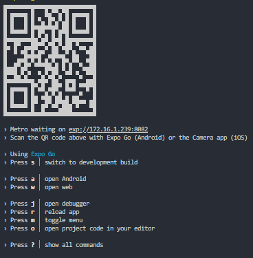

### 🍖 Beef-grill

Uma calculadora de churrasco feita em expo, que possui consumo de receitas externas.

## 📱 Tecnologias utilizadas

- **expo**: buildar e executar o app
- **sqlite**: armazenamento de dados locais 

## 📎 Dependencias 

- **npm**: gerenciador de pacote padrão do node
- **expo go (app no celular)**: aplicativo que permite executar o app no celular

## Instalação 

~~~bash
npm install --legacy-peer-deps 
~~~

Depois execute o seguinte comando para rodar:

~~~bash
npm start
~~~

Por fim, use o app expo go para ler o qrcode ou digite no campo especificado

